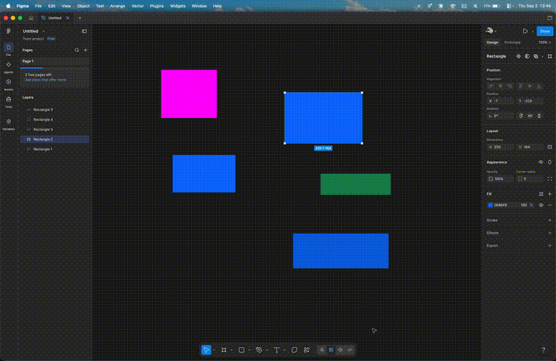

# Token Drift

A Figma plugin that finds colors in a design file that don't match the design tokens in your codebase.



## The problem

Your team's blue is `#0D6EFD`. It's in `tokens.json`, it's in the Tailwind config, it's in the design system doc.

Then someone types `#0D6EFE` on a button in Figma. One hex digit off. Nobody catches it, because nobody can catch it: the perceptual difference between those two colors is ΔE 0.58, and the threshold for human vision is somewhere around 1.0. You are physically incapable of seeing that bug.

It ships. Six months later an engineer is staring at a component that doesn't match anything in the token file and has no idea whether the difference is intentional.

This plugin loads your `tokens.json`, scans every fill in the Figma file, and tells you which ones drifted.

## What you get

Three verdicts per layer:

- **ok** — exact match to a token
- **drift** — close enough to a token that you almost certainly meant it, with a one click fix that writes the correct value back
- **unknown** — not near anything in your token file

Click any row to select and zoom to that layer on canvas.

## Why Lab and not RGB

The obvious way to measure "how close are these two colors" is Euclidean distance in RGB. It doesn't work. RGB isn't perceptually uniform, so a distance of 30 in the green channel is an obvious shift while the same 30 in blue is nearly invisible. Two pairs with identical RGB distance can look nothing alike.

So the pipeline converts to CIELAB, which is built so that numeric distance tracks perceived difference:

```
hex -> sRGB -> linearize (undo gamma) -> XYZ (D65) -> Lab -> ΔE
```

The gamma step is the one people skip. Screen RGB values are perceptually encoded, so `128` is not half the light of `255`. Any math that models how color actually behaves has to undo that first.

Measured on the test file:

| pair | ΔE | verdict |
|---|---|---|
| `#0D6EFD` vs `#0D6EFD` | 0.00 | ok |
| `#0D6EFE` vs `#0D6EFD` | 0.58 | drift |
| `#0A66E0` vs `#0D6EFD` | 11.89 | unknown |
| `#FF00FF` vs `#0D6EFD` | 71.38 | unknown |

## The threshold, and why it's arguable

Drift is currently anything under ΔE 3. That number is a judgment call and I'd defend it only loosely.

ΔE 1 is roughly the just noticeable difference for adjacent colors under good conditions. Setting the cutoff at 1 would catch typos and nothing else, which is safe but not very useful. Setting it at 15 would sweep up colors that are genuinely different design decisions and offer to "fix" them, which is worse than useless because it trains people to ignore the tool.

3 catches typos and rounding errors from color pickers while leaving deliberate variants alone. But look at the table: `#0A66E0` is 11.89 away and lands in "unknown" even though it is visibly a blue that someone probably meant as primary. That's a miss. A better version would either report the nearest match with a confidence score instead of a binary verdict, or tune the threshold per token based on how crowded that region of the palette is.

`DRIFT_THRESHOLD` is a single constant at the top of `code.ts` if you disagree.

## Distance metric

Uses CIE76, plain Euclidean distance in Lab. CIEDE2000 is more accurate, particularly for saturated colors where CIE76 overestimates difference, but it's a much larger implementation and the accuracy gain doesn't change any verdict in practice at this threshold. Worth revisiting if the threshold ever drops below 1.

## Running it

```
npm install
npm run watch
```

Then in Figma desktop: Plugins → Development → Import plugin from manifest, and pick `manifest.json`.

`tokens.json` in the repo root is a sample. Load your own through the file picker in the plugin panel. Nested objects get flattened to dotted names (`color.primary`), and any value that isn't a six digit hex is ignored, so spacing and typography tokens in the same file won't break it.

`test.fig` has five rectangles covering each verdict.

## Limitations

Solid fills only. Gradients, images, and strokes are skipped, and stroke colors drift just as easily as fills, so that's the first thing I'd add.

It reads raw fill values rather than Figma variables and styles. A layer correctly bound to a Figma variable that happens to hold a stale value will read as a plain hex and get flagged. Checking the binding rather than the resolved color would be more correct.

It also scans the current page, not the whole document. `loadAllPagesAsync` is already called so extending this is small, but on a large file the scan is O(nodes × tokens) and would want a spatial index over Lab space rather than a linear scan per node.

## AI assistance

I used Claude while building this. It was useful for the XYZ transformation matrix and the D65 white point constants, which are lookup values with no insight in typing them out, and for catching that `SolidPaint.color` is readonly in Figma's typings.

I rejected its first suggestion for the fix handler, which mutated `fills[0]` in place. Figma's fill arrays are immutable, so that silently does nothing, and index 0 isn't necessarily the fill that got scanned. The working version clones, finds the first solid paint by type, and replaces the whole paint object so opacity and blend mode survive.

The threshold reasoning above is mine and is the part of this I'd most want to argue about.
